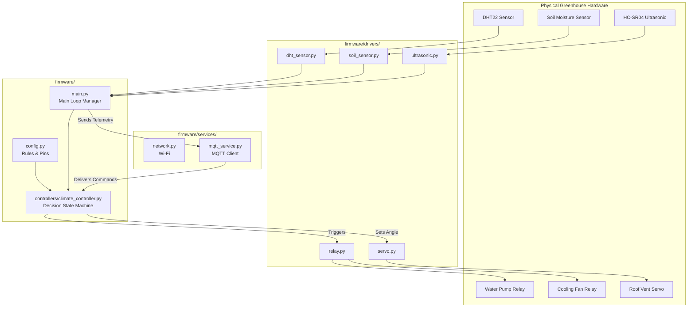

# AGRITECH GREENHOUSE - Person A MicroPython Firmware & Local Simulation Environment

Connected Smart Greenhouse node for **Person A** (Climate & Environmental Monitoring & Microclimate Actuation).

---

## 📖 Table of Contents
1. [System Overview](#-system-overview)
2. [Acronym Glossary (Plain English)](#-acronym-glossary-plain-english)
3. [The Big Picture: How the System Works (Human Body Analogy)](#-the-big-picture-how-the-system-works-human-body-analogy)
4. [Data Flow Diagram (How Files Talk to Each Other)](#-data-flow-diagram-how-files-talk-to-each-other)
5. [Detailed Folder & File Guide](#-detailed-folder--file-guide)
6. [Component Connections & Pinout Guide](#-component-connections--pinout-guide)
7. [MQTT Communication & Data Messages](#-mqtt-communication--data-messages)
8. [How to Run the Local Simulation](#-how-to-run-the-local-simulation)

---

## 🌿 System Overview

**Person A** is responsible for the core environmental sensing, soil health monitoring, automated irrigation, and microclimate ventilation/heating regulation inside the smart greenhouse.

### 🎯 Key System Capabilities
- **Environmental Sensing**: Real-time acquisition of air temperature, relative humidity, soil moisture, ambient light intensity, and water tank depth.
- **Automated Microclimate Regulation**:
  - **Auto Irrigation**: Automatically triggers the water pump when soil moisture falls below `35.0%` until the target moisture of `65.0%` is achieved.
  - **Water Tank Safety Lock**: Immediately locks out and disables the irrigation pump if the water tank level drops below `15.0%` to prevent dry-run pump damage.
  - **Auto Ventilation & Cooling**: Turns on the cooling fan and opens the roof vent hatch to `90°` when air temperature exceeds `28.0°C` or humidity exceeds `80.0%`.
  - **Auto Heating & Insulation**: Turns on the heating mat and closes the roof vent hatch (`0°`) when air temperature drops below `18.0°C`.
- **Remote Telemetry & Control**: Connects via Wi-Fi and MQTT broker (`greenhouse/person_a/telemetry`, `greenhouse/person_a/commands`, `greenhouse/person_a/alerts`).

---

## 📚 Acronym Glossary (Plain English)

Every industry abbreviation used in this project is defined below in plain, easy-to-understand language:

| Acronym | Full Name | Plain English Meaning / What It Does |
|---|---|---|
| **IoT** | Internet of Things | Connecting physical real-world objects (like pumps, fans, and sensors) to the internet so they can be monitored and controlled remotely. |
| **ESP32** | Espressif 32 Microcontroller | The tiny physical computer chip (the "microcontroller board") that sits in the greenhouse and runs our code. |
| **GPIO** | General Purpose Input/Output | The metal connection pins on the ESP32 chip. Sensors plug into *Input* pins; motors and relays plug into *Output* pins. |
| **ADC** | Analog-to-Digital Converter | Translates continuous electrical voltage from a sensor (like wetness in soil) into digital numbers (0 to 4095) the computer understands. |
| **PWM** | Pulse Width Modulation | Rapidly switches power ON and OFF thousands of times per second to control motor angles (like opening a window hatch to 45°). |
| **DHT** | Digital Humidity and Temperature | A small sensor module family (such as DHT11 or DHT22) that measures temperature in Celsius and humidity percentage. |
| **LDR** | Light Dependent Resistor | A light sensor whose electrical resistance changes when sunlight hits it, used to measure brightness. |
| **HC-SR04** | Ultrasonic Distance Sensor Model | A sensor that shoots silent sound waves (like bat sonar) to measure distance to the water surface in a tank. |
| **MQTT** | Message Queuing Telemetry Transport | A super lightweight messaging language used by IoT devices to send sensor data and receive remote commands across the web. |
| **JSON** | JavaScript Object Notation | A clean, human-readable text format for grouping data using simple label-value pairs e.g. `{"temperature": 24.5}`. |
| **Wi-Fi / WLAN** | Wireless Local Area Network | The wireless internet network that connects the greenhouse node to the cloud server or farm dashboard. |
| **IP** | Internet Protocol Address | A unique numerical address (like `192.168.1.105`) assigned to the greenhouse board on the local Wi-Fi network. |
| **SSID** | Service Set Identifier | The visible name of your Wi-Fi network (e.g. `"AGRI_GREENHOUSE_WIFI"`). |
| **CLI** | Command Line Interface | A text-based screen (terminal) where you type commands instead of clicking graphical buttons. |
| **HAL** | Hardware Abstraction Layer | Software code that acts as a translator between raw hardware electronic signals and high-level software logic. |
| **WDT** | Watchdog Timer | A hardware safety countdown clock that automatically reboots the ESP32 board if the software ever freezes. |

---

## 🧠 The Big Picture: How the System Works (Human Body Analogy)

If you don't write code, think of this Smart Greenhouse system as a **Smart Human Body**:

```
        ┌─────────────────────────────────────────────────────────────┐
        │                    1. SENSORY ORGANS                        │
        │      (Sensors: DHT Temp, Soil Moisture, Water Depth)        │
        └──────────────────────────────┬──────────────────────────────┘
                                       │
                                       ▼
        ┌─────────────────────────────────────────────────────────────┐
        │                    2. NERVOUS SYSTEM                        │
        │       (Drivers convert raw signals into percentages)        │
        └──────────────────────────────┬──────────────────────────────┘
                                       │
                                       ▼
        ┌─────────────────────────────────────────────────────────────┐
        │                    3. THE BRAIN & RULES                     │
        │     (Climate Controller evaluates: "Is soil too dry?")     │
        └──────────────────────────────┬──────────────────────────────┘
                                       │
                        ┌──────────────┴──────────────┐
                        ▼                             ▼
        ┌──────────────────────────────┐ ┌───────────────────────────┐
        │      4. MUSCLES & ACTUATORS  │ │     5. MOUTH & EARS       │
        │ (Relays turn Pump/Fan ON)    │ │ (MQTT sends updates/Rx)   │
        └──────────────────────────────┘ └───────────────────────────┘
```

1. **The Sensory Organs** (`firmware/drivers/`): The DHT temperature sensor is like the skin feeling temperature; the soil probe is like tasting moisture; the ultrasonic sensor is like an eye measuring water depth.
2. **The Memory & Rulebook** (`firmware/config.py`): Contains the greenhouse rules (e.g., *"If temperature > 28°C, it's too hot"* or *"If water level < 15%, stop pumping immediately"*).
3. **The Brain** (`firmware/controllers/climate_controller.py`): Compares sensory information against the rulebook every 2 seconds and makes automatic decisions (*"Soil is dry and water tank is full -> Turn ON Irrigation Pump"*).
4. **The Muscles** (`firmware/drivers/relay.py` & `servo.py`): Switches high-power switches (relays) to physically turn ON the water pump, turn ON the cooling fan, or push open the roof vent hatch.
5. **The Mouth & Ears** (`firmware/services/mqtt_service.py`): The mouth speaks (publishes) real-time sensor updates to the farmer's mobile dashboard; the ears listen (subscribes) for manual control commands from the farmer.
6. **The Heartbeat** (`firmware/main.py`): Keeps repeating this 4-step loop endlessly every 2 seconds.
7. **The Flight Simulator** (`sim/`): A complete virtual greenhouse running on your PC. It simulates sun cycles, soil drying, and plant water absorption so you can test everything on your laptop without needing physical hardware!

---

## 🔗 Data Flow Diagram (How Files Talk to Each Other)



---

## 📁 Detailed Folder & File Guide

Below is the complete architectural directory tree along with the specific function and role of every folder and file in the system:

```
AGRITECH-GREEN-HOUSE/
├── .gitignore                       # Specifies untracked files to ignore (bytecode, caches)
├── README.md                        # Primary project documentation & architecture guide
├── requirements.txt                 # Python dependencies for local testing & simulation
├── setup_env.sh                     # Automated setup & test execution bash script
│
├── firmware/                        # MicroPython Firmware (Deploys directly to ESP32 board)
│   ├── boot.py                      # System boot sequence & heap memory garbage collection
│   ├── config.py                    # Centralized GPIO pinout, sensor thresholds, & MQTT settings
│   ├── main.py                      # Main firmware application loop & hardware execution manager
│   │
│   ├── controllers/                 # Automation State Machines & Decision Engines
│   │   └── climate_controller.py    # Microclimate threshold evaluation & safety controller
│   │
│   ├── drivers/                     # Hardware Abstraction Layer (HAL) Sensor & Actuator Drivers
│   │   ├── dht_sensor.py            # DHT11/DHT22 Air Temperature & Humidity driver
│   │   ├── light_sensor.py          # Analog LDR Ambient Light sensor driver
│   │   ├── relay.py                 # Relay driver for Water Pump, Cooling Fan, and Heater
│   │   ├── servo.py                 # Servo Motor driver for roof ventilation hatch (0°-180°)
│   │   ├── soil_sensor.py           # Analog Soil Moisture driver with ADC percentage calibration
│   │   └── ultrasonic.py            # HC-SR04 Ultrasonic water tank fill level driver
│   │
│   ├── services/                    # Networking & Telemetry Communication Layer
│   │   ├── mqtt_service.py          # MQTT publisher (telemetry/alerts) & command listener
│   │   └── network.py               # ESP32 Wi-Fi Station connection manager & reconnect fallback
│   │
│   └── utils/                       # System Utilities
│       └── logger.py                # Dual MicroPython/CPython formatted logging utility
│
├── sim/                             # Local PC Hardware & Physics Simulation (No ESP32 needed!)
│   ├── mqtt_broker_mock.py          # In-memory local MQTT broker & message router
│   ├── run_simulation.py            # Interactive CLI runner & real-time terminal dashboard
│   ├── sensor_simulator.py          # Physical environment simulator (diurnal heat, soil drying)
│   │
│   └── micropython_mock/            # Desktop CPython Compatibility Mocks for MicroPython Libraries
│       ├── dht.py                   # CPython mock for MicroPython 'dht' module
│       ├── machine.py               # CPython mock for MicroPython 'machine' (Pin, ADC, PWM)
│       ├── network.py               # CPython mock for MicroPython 'network' module
│       └── umqtt/
│           ├── __init__.py          # MicroPython umqtt package mock init
│           └── simple.py            # CPython mock for MicroPython 'umqtt.simple.MQTTClient'
│
└── tests/                           # Automated Testing Suite
    └── test_firmware.py             # Unit tests verifying drivers, state machine, & safety locks
```

---

## 🛠️ Detailed File Responsibilities & How Files Depend On Each Other

### 1. Root Workspace Files
| File | Simple Explanation | Technical Role | Link to Other Files |
|---|---|---|---|
| **`README.md`** | System Guide | Documentation | Explains the entire repository. |
| **`requirements.txt`** | Dependency List | Package List | Used by `pip install -r requirements.txt` to install simulation helper tools (`paho-mqtt`, `pytest`). |
| **`setup_env.sh`** | 1-Click Setup Script | Shell Script | Runs automated tests in `tests/test_firmware.py` and prepares `sim/run_simulation.py`. |
| **`.gitignore`** | Cleanup Filter | Git Filter | Tells Git to ignore temporary Python build folders (`__pycache__`). |

---

### 2. Firmware Directory (`firmware/`)
*Contains pure MicroPython code ready to deploy onto physical ESP32 microcontrollers.*

| File / Folder | Simple Explanation | Technical Role | How it links to other files |
|---|---|---|---|
| **`firmware/config.py`** | Greenhouse Rulebook & Pin Assignment | Configuration Constants | Imported by **ALL** drivers, controllers, and services to get pin numbers, temperature targets, and MQTT names. |
| **`firmware/boot.py`** | Startup Sequence | Boot Initialization | Runs automatically when ESP32 powers ON. Prepares memory heap before `main.py` starts. |
| **`firmware/main.py`** | System Heartbeat | Main Controller Loop | Imports all `drivers/`, `controllers/`, and `services/`. Calls `run_cycle()` every 2 seconds to keep the greenhouse running. |
| **`firmware/controllers/climate_controller.py`** | System Brain | Decision State Machine | Receives data from `main.py`, checks `config.py` rules, and commands `relay.py` and `servo.py` to turn equipment ON/OFF. |
| **`firmware/drivers/dht_sensor.py`** | Air Sensor Driver | Hardware Driver | Connects to GPIO 4. Returns air temperature (°C) and humidity (%) to `main.py`. |
| **`firmware/drivers/soil_sensor.py`** | Soil Moisture Driver | Hardware Driver | Reads ADC pin 34. Converts raw voltage to 0%-100% moisture percentage for `main.py`. |
| **`firmware/drivers/light_sensor.py`** | Light Sensor Driver | Hardware Driver | Reads ADC pin 35. Converts sunlight readings to light percentages for `main.py`. |
| **`firmware/drivers/ultrasonic.py`** | Tank Water Depth Driver | Hardware Driver | Sends sound pulses on GPIO 5 & 18. Calculates water tank fill level percentage for `main.py`. |
| **`firmware/drivers/relay.py`** | High-Power Switch Driver | Actuator Driver | Controls relays on GPIO 25, 26, 27 to physically turn ON/OFF the Water Pump, Cooling Fan, and Heater. |
| **`firmware/drivers/servo.py`** | Roof Motor Driver | Actuator Driver | Controls PWM signal on GPIO 14 to rotate the roof hatch between 0° (Closed) and 90° (Open). |
| **`firmware/services/network.py`** | Wi-Fi Manager | Network Service | Connects ESP32 to local Wi-Fi router specified in `config.py`. |
| **`firmware/services/mqtt_service.py`** | Cloud Communicator | Messaging Service | Transmits sensor reports to MQTT server (`greenhouse/person_a/telemetry`) and passes remote commands to `climate_controller.py`. |
| **`firmware/utils/logger.py`** | Formatted Terminal Logger | System Utility | Prints clean timestamped logs (`[INFO]`, `[WARN]`, `[ERROR]`) to the terminal screen. |

---

### 3. Simulation Directory (`sim/`)
*Allows running and testing Person A firmware locally on any PC without requiring physical hardware.*

| File / Folder | Simple Explanation | Technical Role | How it links to other files |
|---|---|---|---|
| **`sim/micropython_mock/machine.py`** | Fake Hardware Pins | CPython Mock | Fools `firmware/` into believing it is running on a real ESP32 board when running on a PC. |
| **`sim/micropython_mock/dht.py`** | Fake DHT Sensor | CPython Mock | Provides fake temperature readings when testing on a PC. |
| **`sim/micropython_mock/network.py`** | Fake Wi-Fi | CPython Mock | Simulates Wi-Fi connection when testing on a PC. |
| **`sim/micropython_mock/umqtt/simple.py`** | Fake MQTT Client | CPython Mock | Redirects MQTT messages to `sim/mqtt_broker_mock.py`. |
| **`sim/sensor_simulator.py`** | Virtual Greenhouse Environment | Physics Simulator | Simulates realistic sun cycles, soil drying, and plant water usage in real time. |
| **`sim/mqtt_broker_mock.py`** | Internal Message Broker | In-Memory Broker | Routes messages between `sim/run_simulation.py` and `firmware/main.py`. |
| **`sim/run_simulation.py`** | Interactive PC Console | Simulation Launcher | Displays a live visual dashboard on your computer terminal screen with interactive key controls. |

---

### 4. Tests Directory (`tests/`)
| File | Simple Explanation | Technical Role | How it links to other files |
|---|---|---|---|
| **`tests/test_firmware.py`** | Automated Quality Inspector | Unit Test Suite | Automatically runs 9 test checks on `firmware/drivers/` and `climate_controller.py` to prove there are no bugs. |

---

## 🔌 Component Connections & Pinout Guide

Here is how every physical component connects to the ESP32 microcontroller board:

| Physical Hardware Component | ESP32 Board Pin | Signal Type | What It Measures / Controls |
|---|---|---|---|
| **DHT22 Temperature/Humidity** | GPIO 4 | Digital Input | Air temperature (°C) & humidity (%) |
| **Analog Soil Moisture Sensor** | GPIO 34 | Analog (ADC1_CH6) | Moisture percentage in soil (0-100%) |
| **LDR Light Sensor** | GPIO 35 | Analog (ADC1_CH7) | Ambient sunlight intensity |
| **HC-SR04 Water Sensor Trigger** | GPIO 5 | Digital Output | Sends ultrasonic ping sound wave |
| **HC-SR04 Water Sensor Echo** | GPIO 18 | Digital Input | Receives bounced echo pulse |
| **Water Pump Relay** | GPIO 26 | Digital Output | Switches 12V Water Pump ON/OFF |
| **Cooling Fan Relay** | GPIO 27 | Digital Output | Switches 12V Ventilation Fan ON/OFF |
| **Heating Mat Relay** | GPIO 25 | Digital Output | Switches 12V Heating Mat ON/OFF |
| **Roof Vent Hatch Servo** | GPIO 14 | PWM (50Hz) | Rotates roof hatch motor (0°-90°) |
| **On-board Status LED** | GPIO 2 | Digital Output | Flashes to show system heartbeat |

---

## 📡 MQTT Communication & Data Messages

### 1. Telemetry Data Broadcast (`greenhouse/person_a/telemetry`)
Sent automatically every 5 seconds to cloud dashboards:
```json
{
  "device_id": "GREENHOUSE-NODE-A",
  "node_type": "CLIMATE_SOIL_CONTROLLER",
  "temperature": 24.5,
  "humidity": 58.0,
  "soil_moisture": 42.0,
  "light_intensity": 75.0,
  "water_level": 82.5,
  "mode": "AUTO",
  "actuators": {
    "pump": "OFF",
    "fan": "OFF",
    "heater": "OFF",
    "vent_angle": 0
  },
  "alerts": []
}
```

### 2. Command Data Receiver (`greenhouse/person_a/commands`)
Remote commands sent from farmer's mobile app:
- **Switch Mode**: `{"action": "SET_MODE", "value": "AUTO"}` or `{"action": "SET_MODE", "value": "MANUAL"}`
- **Manual Control**:
  - Turn Pump ON: `{"action": "PUMP", "value": "ON"}`
  - Turn Fan ON: `{"action": "FAN", "value": "ON"}`
  - Set Vent Angle: `{"action": "VENT", "value": 45}`

---

## 🚀 How to Run the Local Simulation

You can test the entire smart greenhouse system on your PC without physical ESP32 hardware!

### 1. Execute Setup & Automated Unit Tests
```bash
chmod +x setup_env.sh
./setup_env.sh
```

### 2. Launch Interactive Terminal Dashboard
```bash
python3 sim/run_simulation.py
```

#### Interactive Console Keys:
- **`[1]`**: Simulate dry soil (<35%) -> Triggers automatic irrigation pump.
- **`[2]`**: Simulate heatwave (>30°C) -> Triggers cooling fan & opens roof vent hatch.
- **`[3]`**: Simulate cold drop (<18°C) -> Triggers heating mat & closes roof vent.
- **`[4]`**: Empty water tank (<15%) -> Triggers low-water safety lock (disables pump).
- **`[5]`**: Refill water tank (100%).
- **`[m]`**: Send manual MQTT override commands.
- **`[q]`**: Exit simulation.
